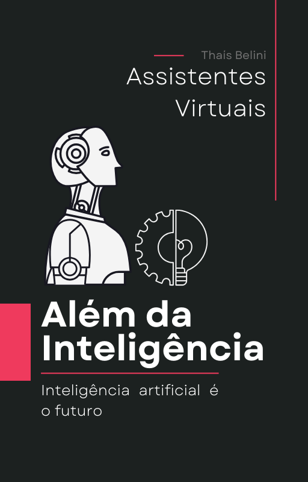

    

-------

# Projeto EBOOK Gerado por I.A.s

Projeto com o objetivo de gerar um ebook digital com as facilidades das ferramentas de IA. todos os prompts
seguem abaixo.

<a href=" " title="View PDF now"> 📕Clique aqui para ler</a>

## 💻 Tecnologias utilizadas no projeto

- [ChatGPT](https://chat.openai.com/) 
- [Canva](https://www.canva.com/)

## 🧠 Prompts

ChatGPT：

|   Ação   | prompt                                                                                                                                                                                                                                                                         |
| :------: | ------------------------------------------------------------------------------------------------------------------------------------------------------------------------------------------------------------------------------------------------------------------------------ |
|  título  | Crie um título de um e-book sobre o tema assistentes virtuais, o e-book é do nicho de inteligência artificial e o subtítulo assistentes virtuais, o título deve ser épico e curto. Tenha uma temática futurística. Me liste cinco variações de títulos |
| conteúdo | Faça um texto para e-book , com foco em Assistentes Virtuais, listando os principais assistentes com exemplos básicos de como utiliza-los {REGRAS} Explique sempre de uma maneira simples Deixe o texto enxuto, Sempre traga exemplos de uso em contextos reais , sempre deixe um título sugestivo por tópico |

## ✨ Features

- Conteúdo gerado via ChatGPT
- Imagens geradas via Canva

## 📚 Materiais

- Imagens utilizadas em `assets`
- ebook gerado durante as aulas em `output`

## 🛠️ Instruções de execução

Utilize os prompts acima nas ferramentas sugeridas para gerar o material base e utilize uma ferramenta de edição de documentos como power point, libreoffice , indesign para diagramação.

⌨️ com 💜 por [Thaís Belini](https://github.com/thabelini)